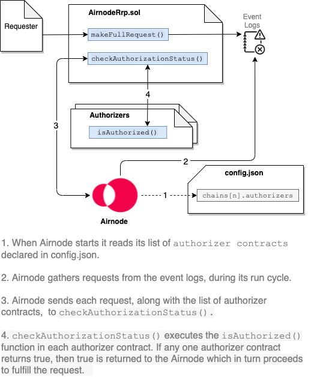

<TitleSpan>Concepts and Definitions</TitleSpan>
# {{$frontmatter.title}}

<TocHeader />
<TOC class="table-of-contents" :include-level="[2,3]" />

When an Airnode receives a request, it can use on-chain authorizers to verify if a response is warranted. Authorizers allow Airnodes to implement a wide variety of policies. Below are some examples:

- Respond to requests from sponsors that have paid their monthly subscription fee in DAI
- Respond to individual requests for which a per-call fee has been paid in API3 tokens
- Respond to requests made by requesters that were whitelisted by the API3 DAO
- Respond to requests made by sponsors who have been whitelisted by the Airnode owner's backend (for example, based on PayPal payments)
<br/><br/>

>

## Authorizer List

Airnode authorizers are listed in their config.json file at [`chains[n].authorizers`](../grp-providers/guides/build-an-airnode/configuring-airnode.md#chains). An authorizer typically checks for a single condition (has the requester made their monthly payment, is the `requester` whitelisted, etc.). Authorizers can be combined to enforce more complex policies. If any of the authorizers in the list gives access, the request will considered to be authorized. From a logical standpoint, the authorization outcomes get `OR`ed.

## Authorizer Interface

Authorizer contracts can be used to implement an arbitrary authorization policy based on it input parameters.

- `requestId`: bytes32
- `airnode`: address
- `endpointId`: bytes32
- `address`: sponsor
- `requester`: address

Note that the authorizer does not have to use all of the arguments, and can even decide on external criteria such as `blockNumber` (e.g., do not respond to anyone after block number N). An authorizer is a contract with the following interface:

```solidity
interface IRrpAuthorizer {
    function AUTHORIZER_TYPE() external view returns (uint256);

    function isAuthorized(
        bytes32 requestId,
        address airnode,
        bytes32 endpointId,
        address sponsor,
        address requester
    ) external view returns (bool);
}
```

## Why is the authorizer scheme needed?

Airnodes have to be able to fulfill requests selectively. This is required for two main reasons:

1. The Airnode only fulfills requests made by requesters who have made payment to the Airnode owner, which allows them to monetize their services.
1. The services of the Airnode are sensitive and can only be accessed by certain requesters, e.g., who have gone through KYC.

A protocol that does not have the authorizer scheme or equivalent functionality cannot be considered as permissionless, and will not be able to achieve wide-spread adoption.

## Are authorizers required?

Authorizers are not required. An API provider can use other forms of authorization such tradition API authentication (apiKey, basic, bearer). And it is possible to use both authorizers and traditional API authentication.

## How are authorizers implemented?

There are two main points to consider about how authorization policies are implemented:

1. If the policies are kept off-chain, the requester cannot see them or check if they satisfy them. Furthermore, the Airnode owner updating the policies (e.g., increasing the service fees) requires off-chain coordination with the requester.
2. Embedding the policies in the request–response loop results in a gas cost overhead.

Based on these considerations, Airnode uses a hybrid method. An Airnode announces its authorization policy through off-chain channels as the addresses of a list of authorizer contracts. Whenever the Airnode receives a request, it checks if it should fulfill this request by making a static call that queries this on-chain policy. Similarly, the requester can use this on-chain policy by making a static call to check if they are authorized. This scheme both allows the Airnode to set transparent and flexible policies, and this to be done with no gas overhead.

## Authorizer Behavior

How authorizers behave is based on their entry in `chains` field of `config.json` for a givin Airnode.

### Deny All

If the Airnode wants to deny all access on a chain, it should not operate on it (i.e., it should not exist in the chains list). The below example would "deny all" to chains 1 and 3-n since they do not have entries in the chains field.

```json
 chains:[
   id:2,
   authorizers:[]
   ...
 ]
```

### Allow All

An authorizer list of [] means "let everyone through". In the example below chain 2 would allow access to any requester.

```json
  chains:[
    {
      id:2,
      authorizers:[]
      ...
    }
 ]
```
### Filter All

If the Airnode wants to give access selectively, it should use one or more authorizers that implement filtering logic. In the example below the Airnode will accept requests on chain 2 and the requester (identified by the requester contract address) will be filtered by two authorizers.

```json
 chains:[
   id:2,
   authorizers:['0xcd...cd8d','0xff...d19c]
   ...
 ]
```

## API Authentication

Sometimes the Airnode operator does not want to use on-chain authorizers.

- the parameter that authorization depends on (e.g., if the requester has paid) should not be made public
- the Airnode operator does not want to interact with the chain to alter authorization statuses (e.g., does not want to make a transaction to whitelist a new user, which will cost them gas fees)

In this case, the Airnode operator can use standard [API authentication](api-auth.md) practices such as basic auth, bearer or an apiKey.

<Fix>Need clarity on the <code>_relay_metadata</code> parameter.</Fix>
Also the Airnode operator can use the `_relay_metadata` parameter for the Airnode to pass-through request metadata, which the API backend can process and respond (or not) accordingly.

<Fix>Adding <code>AirnodeRequesterRrpAuthorizer</code> and <code>DaoRequesterRrpAuthorizer</code> was discussed in api3-docs PR https://github.com/api3dao/api3-docs/pull/186</Fix>

## AirnodeRequesterRrpAuthorizer

## DaoRequesterRrpAuthorizer
